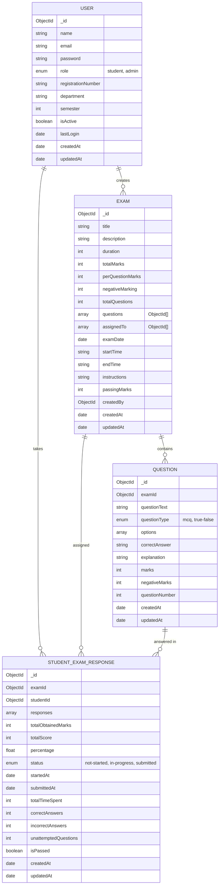

<<<<<<< HEAD
# Online Examination System - MERN Stack

A complete full-stack online examination platform built with MongoDB, Express.js, React.js, and Node.js. This system supports both Admin and Student roles with comprehensive exam management, real-time scoring, and detailed analytics.

## 📋 Table of Contents

- [Features](#features)
- [Tech Stack](#tech-stack)
- [System Architecture](#system-architecture)
- [Database Schema (ER Diagram)](#database-schema-er-diagram)
- [Installation](#installation)
- [Usage](#usage)
- [API Routes](#api-routes)
- [Project Structure](#project-structure)
- [Deployment](#deployment)
- [Seed Data](#seed-data)
- [Troubleshooting](#troubleshooting)

## ✨ Features

### Admin Panel
- ✅ Admin Login & Authentication
- ✅ CRUD Operations for Students (Add, View, Edit, Delete)
- ✅ CRUD Operations for Exams
- ✅ CRUD Operations for Questions (MCQ Format)
- ✅ Assign/Remove exams to/from students
- ✅ Configure exam settings (duration, marks, negative marking)
- ✅ Dashboard with statistics
- ✅ View student responses and detailed results
- ✅ Export results as CSV
- ✅ Exam performance analytics

### Student Panel
- ✅ Student Registration & Login
- ✅ View assigned exams
- ✅ Read exam instructions before starting
- ✅ Take exam with real-time timer
- ✅ Auto-submit when timer ends
- ✅ Save answers while attempting
- ✅ Navigate between questions
- ✅ View results immediately after submission
- ✅ Detailed result analysis (marks, correct/incorrect, time taken)
- ✅ Review attempted questions with explanations

### Security Features
- ✅ JWT Authentication (Access + Refresh Tokens)
- ✅ Password encryption with bcrypt
- ✅ Role-based access control (Admin/Student)
- ✅ Protected API endpoints
- ✅ Tab switching detection (optional)

## 🛠️ Tech Stack

### Frontend
- **React.js 18** - UI Framework
- **React Router v6** - Routing
- **Axios** - HTTP Client
- **TailwindCSS** - Styling
- **Zustand** - State Management
- **React Icons** - Icons
- **React Hot Toast** - Notifications
- **Date-fns** - Date Utilities

### Backend
- **Node.js** - Runtime
- **Express.js** - Web Framework
- **MongoDB** - Database
- **Mongoose** - ODM
- **JWT** - Authentication
- **bcryptjs** - Password Hashing
- **Express Validator** - Input Validation
- **CSV Writer** - Export to CSV

### DevOps
- **Docker** - Containerization
- **Docker Compose** - Multi-container orchestration

## 📊 Database Schema (ER Diagram)



## 🚀 Installation

### Prerequisites
- Node.js (v14 or higher)
- MongoDB (v4.4 or higher)
- npm or yarn
- Docker & Docker Compose (optional)

### Local Setup (Without Docker)

#### 1. Clone the repository
```bash
git clone <repository-url>
cd examination-system
```

#### 2. Backend Setup
```bash
cd backend

# Copy environment file
cp .env.example .env

# Install dependencies
npm install

# Start MongoDB (make sure it's running)
# Linux/Mac:
mongod

# Windows:
# Use MongoDB Shell or Docker

# Run seed data (optional)
node scripts/seedData.js

# Start backend server
npm run dev
```

#### 3. Frontend Setup
```bash
cd frontend

# Copy environment file
cp .env.example .env

# Install dependencies
npm install

# Start frontend development server
npm start
```

The application will be available at:
- **Frontend**: http://localhost:3000
- **Backend API**: http://localhost:5000

### Docker Setup

```bash
# From project root directory

# Copy environment files
cp backend/.env.example backend/.env
cp frontend/.env.example frontend/.env

# Build and start all services
docker-compose up --build

# Seed data (in separate terminal)
docker exec exam-backend node scripts/seedData.js
```

Services will be available at:
- Frontend: http://localhost:3000
- Backend: http://localhost:5000
- MongoDB: localhost:27017

## 📖 Usage

### Admin Login
1. Visit http://localhost:3000
2. Click "Login"
3. **Email**: admin@example.com
4. **Password**: admin123
5. Access admin dashboard with full management features

### Student Login
1. Visit http://localhost:3000
2. Click "Login" or "Register"
3. **Email**: student1@example.com
4. **Password**: student123
5. View assigned exams and take tests

### Taking an Exam (Student)
1. Navigate to Dashboard
2. Select an exam from "Available Exams"
3. Read instructions and agree to terms
4. Click "Start Exam"
5. Answer questions using Next/Previous navigation
6. Timer will auto-submit when time expires
7. View results and analysis immediately

### Managing Exams (Admin)
1. Go to Admin Dashboard
2. Click "Exams" tab
3. Create new exam or edit existing
4. Add questions to exam
5. Assign exam to students
6. View results and download as CSV

## 📚 API Routes

### Authentication Endpoints

| Method | Endpoint | Description | Auth |
|--------|----------|-------------|------|
| POST | `/api/auth/register` | Register student | No |
| POST | `/api/auth/login` | Login user | No |
| POST | `/api/auth/refresh-token` | Refresh access token | No |
| GET | `/api/auth/me` | Get current user | Yes |
| POST | `/api/auth/logout` | Logout user | Yes |

### Student Management (Admin Only)

| Method | Endpoint | Description | Auth |
|--------|----------|-------------|------|
| GET | `/api/students` | Get all students | Admin |
| GET | `/api/students/:id` | Get student by ID | Admin |
| POST | `/api/students` | Create new student | Admin |
| PUT | `/api/students/:id` | Update student | Admin |
| DELETE | `/api/students/:id` | Delete student | Admin |
| PATCH | `/api/students/:id/activate` | Activate student | Admin |
| PATCH | `/api/students/:id/deactivate` | Deactivate student | Admin |

### Exam Management

| Method | Endpoint | Description | Auth |
|--------|----------|-------------|------|
| GET | `/api/exams` | Get all exams | Admin |
| GET | `/api/exams/:id` | Get exam details | Admin/Student |
| POST | `/api/exams` | Create exam | Admin |
| PUT | `/api/exams/:id` | Update exam | Admin |
| DELETE | `/api/exams/:id` | Delete exam | Admin |
| GET | `/api/exams/assigned` | Get assigned exams | Student |
| POST | `/api/exams/:id/assign-students` | Assign exam to students | Admin |
| POST | `/api/exams/:id/remove-students` | Remove exam from students | Admin |
| GET | `/api/exams/:id/statistics` | Get exam statistics | Admin |

### Question Management

| Method | Endpoint | Description | Auth |
|--------|----------|-------------|------|
| GET | `/api/questions/exam/:examId` | Get exam questions | Admin |
| GET | `/api/questions/:id` | Get question details | Admin |
| POST | `/api/questions` | Create question | Admin |
| PUT | `/api/questions/:id` | Update question | Admin |
| DELETE | `/api/questions/:id` | Delete question | Admin |
| POST | `/api/questions/bulk-create` | Create multiple questions | Admin |
| GET | `/api/questions/:id/for-student` | Get question (no answer) | Student |

### Exam Results

| Method | Endpoint | Description | Auth |
|--------|----------|-------------|------|
| POST | `/api/results/:examId/start` | Start exam | Student |
| POST | `/api/results/:examId/save-answer` | Save answer | Student |
| POST | `/api/results/:examId/submit` | Submit exam | Student |
| GET | `/api/results/:examId/result` | Get exam result | Student |
| GET | `/api/results/my-results` | Get student's all results | Student |
| GET | `/api/results/exam/:examId/all-results` | Get all exam results | Admin |
| GET | `/api/results/exam/:examId/export-csv` | Export results as CSV | Admin |
| GET | `/api/results/student/:studentId/:examId` | Get student's specific result | Admin |
| GET | `/api/results/dashboard/statistics` | Dashboard statistics | Admin |

## 📁 Project Structure

```
examination-system/
├── backend/
│   ├── controllers/
│   │   ├── authController.js
│   │   ├── studentController.js
│   │   ├── examController.js
│   │   ├── questionController.js
│   │   └── resultController.js
│   ├── models/
│   │   ├── User.js
│   │   ├── Exam.js
│   │   ├── Question.js
│   │   └── StudentExamResponse.js
│   ├── routes/
│   │   ├── authRoutes.js
│   │   ├── studentRoutes.js
│   │   ├── examRoutes.js
│   │   ├── questionRoutes.js
│   │   └── resultRoutes.js
│   ├── middlewares/
│   │   ├── auth.js
│   │   ├── authorize.js
│   │   ├── errorHandler.js
│   │   └── validators.js
│   ├── config/
│   │   ├── db.js
│   │   └── jwt.js
│   ├── utils/
│   │   ├── asyncHandler.js
│   │   └── csvExporter.js
│   ├── scripts/
│   │   └── seedData.js
│   ├── server.js
│   ├── package.json
│   ├── .env.example
│   ├── Dockerfile
│   └── README.md
│
├── frontend/
│   ├── src/
│   │   ├── pages/
│   │   │   ├── Login.jsx
│   │   │   ├── Register.jsx
│   │   │   ├── StudentDashboard.jsx
│   │   │   ├── ExamInstructions.jsx
│   │   │   ├── ExamPage.jsx
│   │   │   ├── ResultPage.jsx
│   │   │   └── admin/
│   │   │       ├── AdminDashboard.jsx
│   │   │       ├── StudentsManagement.jsx
│   │   │       ├── ExamsManagement.jsx
│   │   │       ├── QuestionsManagement.jsx
│   │   │       └── ResultsManagement.jsx
│   │   ├── components/
│   │   │   ├── PrivateRoute.jsx
│   │   │   ├── AdminRoute.jsx
│   │   │   ├── StudentRoute.jsx
│   │   │   ├── Navbar.jsx
│   │   │   ├── Sidebar.jsx
│   │   │   ├── ExamTimer.jsx
│   │   │   └── StatCard.jsx
│   │   ├── context/
│   │   │   └── authStore.js
│   │   ├── services/
│   │   │   ├── axios.js
│   │   │   └── api.js
│   │   ├── styles/
│   │   │   └── index.css
│   │   ├── App.jsx
│   │   └── index.js
│   ├── public/
│   │   └── index.html
│   ├── package.json
│   ├── .env.example
│   ├── tailwind.config.js
│   ├── Dockerfile
│   └── README.md
│
├── docker-compose.yml
└── README.md
```

## 🚀 Deployment

### Deploy to Render

#### Backend Deployment
1. Push code to GitHub
2. Go to https://render.com
3. Create new Web Service
4. Connect GitHub repository (backend folder)
5. Set environment variables in Render dashboard
6. Deploy

#### Frontend Deployment
1. Build the application: `npm run build`
2. Deploy to Vercel/Netlify:
   - Connect GitHub repository
   - Set `REACT_APP_API_URL` to your backend URL
   - Deploy

### Deploy with Docker to AWS ECS

```bash
# Push image to ECR
aws ecr get-login-password --region us-east-1 | docker login --username AWS --password-stdin <account-id>.dkr.ecr.us-east-1.amazonaws.com

docker build -t exam-system .
docker tag exam-system:latest <account-id>.dkr.ecr.us-east-1.amazonaws.com/exam-system:latest
docker push <account-id>.dkr.ecr.us-east-1.amazonaws.com/exam-system:latest

# Create ECS task definition and service
# Use docker-compose.yml as reference
```

## 🌱 Seed Data

### Create Sample Data

```bash
# From backend directory
node scripts/seedData.js
```

This will create:
- 1 Admin account
- 5 Student accounts
- 2 Sample exams
- 10 Sample questions

**Default Credentials:**
- Admin: `admin@example.com` / `admin123`
- Student: `student1@example.com` / `student123`

## 🐛 Troubleshooting

### MongoDB Connection Error
```
Error: connect ECONNREFUSED 127.0.0.1:27017
```
**Solution**: Ensure MongoDB is running
```bash
# Check if MongoDB is running
mongosh

# If not, start MongoDB
mongod
```

### Port Already in Use
```
Error: listen EADDRINUSE: address already in use :::5000
```
**Solution**: Change port in .env or kill process
```bash
# Kill process using port 5000
lsof -ti:5000 | xargs kill -9
```

### CORS Error
**Solution**: Update `CLIENT_URL` in backend .env to match frontend URL

### Token Expired
**Solution**: The app automatically refreshes tokens. If issues persist, clear localStorage and re-login.

## 📧 Support & Contact

For issues or questions, please contact the development team.

## 📄 License

This project is licensed under the MIT License - see LICENSE file for details.

---

**Created with ❤️ using MERN Stack**

Last Updated: 2025-01-17
=======
# Online-Examination-System
The Online Examination System is a web-based platform that enables educational institutes and organizations to conduct exams online securely and efficiently. It provides separate dashboards for students and administrators, allowing smooth management of exams, questions, and results.
>>>>>>> 8406d39c6788be48576d6277b3deb869f2fad48b
